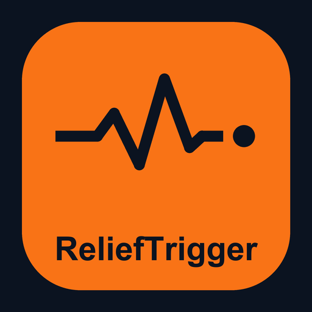

# ReliefTrigger

[](https://opensource.org/license/mit/)



**Pre-funded disaster relief, released when GenLayer validators confirm a GDACS alert.**

After an earthquake or a cyclone, the money exists long before it moves. Somebody has to decide the disaster is real and
big enough, then approve a transfer, and local responders wait days or weeks in the window when cash matters most.
Anticipatory-action programmes (the Red Cross DREF, the UN CERF, parametric insurance) fix this by agreeing the trigger
*in advance*. ReliefTrigger makes that trigger a contract anyone can fund:

1. A **donor** names the responder's wallet (an NGO, a local partner) and fixes the terms: which hazards, which countries
   (ISO3), the minimum GDACS alert level, a minimum magnitude or wind speed, a minimum number of people exposed to strong
   shaking, the dates covered and, optionally, a plain-language **area condition**. Anyone can add GEN to the pool.
2. When something happens, **anyone triggers** the pool with a GDACS event id.
3. **Every GenLayer validator** fetches that event from GDACS itself and, for earthquakes, cross-checks the magnitude with
   USGS. Every countable term is decided in code. Only if all of them pass, and the pool has an area condition, do the
   validators' LLMs judge the area.
4. For 10 minutes the side the ruling goes against can ask once for an independent re-assessment: donors who gave
   before the claim if it pays, the recipient if it does not. Paying out before the window ends needs approval from
   donors holding more than half of the donations made before the claim.
5. The payout goes **straight to the responder's wallet**. Each event pays a pool once. When coverage ends, donors
   reclaim what is left, pro-rata.

A donor dashboard, an auditor or another contract calls `was_paid(pool_id, type, event_id)` to see which disasters a
pool funded, without trusting any single party's report.

**Live app:** [relieftrigger-bars26.vercel.app](https://relieftrigger-bars26.vercel.app). Reads need no wallet. Writes need
MetaMask on GenLayer Studio (chain 61999); the **Test GEN** button funds your wallet from the Studio faucet.
**Contract:** [`0xe4748A37243C79A7e72B1423E4DcDDb69f3DE4Ab`](https://explorer-studio.genlayer.com/address/0xe4748A37243C79A7e72B1423E4DcDDb69f3DE4Ab) on GenLayer Studio.

## Verified live, on real disasters

`scripts/demo.mjs` ran three pools against real GDACS events with real validator consensus and real LLM calls. Every
transaction hash is in [`docs/REPRODUCTION.md`](docs/REPRODUCTION.md).

| Pool and terms | GDACS event (real) | Validators read | Verdict | Outcome |
|---|---|---|---|---|
| Central Myanmar, EQ, M ≥ 7, ≥ 1M exposed, area *"Mandalay or Sagaing Region"* | EQ 1474479, the M6.7 aftershock | M6.7, USGS M6.7 | Does not meet (`severity`) | Dismissed by the recipient |
| same | EQ 1477002, M5.5 two weeks later | M5.5, USGS M5.3 | Does not meet (`severity`) | Left pending; the next trigger supersedes it at once |
| same | EQ 1474477, the M7.7 Mandalay earthquake of 2025-03-28 | Red, M7.7, USGS M7.7 "Mandalay", 17.2M exposed | **Meets** (LLM judged the area) | **4 GEN to the responder** |
| Mexico Pacific hurricanes, TC, Red, ≥ 180 km/h | EQ 1474477 | an earthquake | Does not meet (`hazard`) | Dismissed |
| same | TC 1001325, Hurricane POLO-26 | Red, MEX, 287 km/h | **Meets**, contested by a donor, re-assessed **Meets** | **2 GEN to the responder** |
| Rakhine coast, EQ, M ≥ 6, area *"Rakhine State on the western coast"* | EQ 1474477, the same Mandalay earthquake | every coded term passes | Does not meet (LLM judged the area) | Dismissed |
| DEMO wildfire recovery, WF, six Mediterranean countries, Red | WF 1029628, the July 2026 forest fires in France | Red, FRA, 47,910 ha burned | **Meets** | **3 GEN to the responder** |

In the scripted run the responder's wallet went from 1 to **7 GEN** (4 + 2), the donors paid exactly what they put in,
and the contract held the 19 GEN left in the three pools; the wildfire pool, added afterwards, brought the responder to **10 GEN**. A 0.05 GEN donation below the minimum was refunded, not kept.

The demo pool names and terms are written for the test; the events and every fact the validators read are real GDACS and
USGS records.

Those pools prove the mechanism on past disasters. Real use runs the other way: the GEN waits in the contract for a
disaster that has not happened yet, so nothing has to be raised in the first 48 hours. `pool_3` is a labelled DEMO of
that: 30 GEN pre-positioned for a Red-alert M7+ earthquake in the Marmara region of Türkiye (the long-expected North
Anatolian Fault event near Istanbul), covering 2026 to 2036.

## How a claim is assessed

Each validator runs the same function inside `gl.eq_principle.strict_eq`:

1. **Fetch the event** from `gdacs.org/gdacsapi/api/events/geteventdata`: hazard type, affected countries (ISO3), alert
   level, start date, severity, and for earthquakes the number of people in MMI VII+ shaking (`shakepop`).
2. **Earthquakes are cross-checked with USGS.** The GDACS record names its USGS source id; validators fetch
   `earthquake.usgs.gov/fdsnws/event/1/query?eventid=…` and require the two magnitudes to agree within 0.3. If USGS
   cannot be read, the claim is `UNCLEAR`, never `MEETS`.
3. **Everything countable is decided in code, in a fixed order:** GDACS unreachable → `UNCLEAR`; hazard, country, alert,
   date, sources disagree, severity, exposure → `DOES_NOT_MEET` with the failing term recorded as the reason code.
   The model is never asked about a number.
4. **Only the area goes to the LLM**, and only when every coded term passed. The donors' area text and the event record
   are wrapped as untrusted data; the answer must be exactly `MEETS`, `DOES_NOT_MEET` or `UNCLEAR`, anything else reverts.
5. Validators must agree on a small JSON of the verdict, the reason code and the coarse facts (hazard, countries, alert,
   date, severity, exposure, USGS magnitude). Those facts are stored with the claim and shown in the app, so anyone can
   see exactly what was read.

## Game theory

| Rule | Why |
|---|---|
| Terms are fixed at creation; the recipient is fixed too | Donors know exactly what their GEN can pay for and to whom |
| Pool ≥ 1 GEN, donation ≥ 0.1 GEN, payout ≤ initial funding | No dust pools; a pool can always pay at least once |
| Triggering is permissionless | Nobody can sit on a qualifying disaster |
| One pending claim per pool; a pending claim that does not meet the terms is replaced by the next trigger (logged as superseded), a pending `MEETS` claim is not | No races for the same balance, and nobody can park irrelevant events on a pool to delay a real disaster |
| Each GDACS event pays a pool at most once (`paid_events`) | Re-triggering the same disaster cannot drain the pool |
| The say in a claim is snapshotted when it is triggered: each donor's GEN given **before** the claim; the recipient's own donations never count | Nobody can buy a vote in a claim that is already open, and the beneficiary has no say in its own payout |
| Releasing a `MEETS` payout before the contest window ends needs `approve_release` from donors holding **more than half** of that snapshot | A single or minority donor cannot pay out on behalf of everyone else |
| Contests belong to the side a ruling goes against: donors (pre-claim) contest a payout, the recipient contests anything else; each side once per claim | The beneficiary cannot spend the only contest on a ruling that already favours it |
| Every contest restarts the 10-minute window and clears approvals | A contest can never be used to skip straight to settlement; the other side can always answer a changed ruling |
| Only the recipient can dismiss a non-paying claim early; after the window anyone resolves | Dismissal only costs the recipient, and a claim can never be stuck |
| Payout = min(payout, balance), integer arithmetic | No model decides an amount |
| After coverage ends anyone closes; each donor reclaims `contribution × closing_balance ÷ total_donated`, once, and the last donor also takes the rounding remainder | Unspent money goes back in proportion; nobody can take more than their share and no wei is left stranded |

## Two GenLayer money pitfalls, and how ReliefTrigger handles them

**1. Paying a wallet needs an external message.** `gl.get_contract_at(addr).emit_transfer(value=...)` sends an internal
GenVM message; a wallet has no code to run and the GEN never arrives. ReliefTrigger pays recipients and reclaiming donors
through an external EVM message:

```python
@gl.evm.contract_interface
class _Wallet:
    class View: pass
    class Write: pass

_Wallet(to).emit_transfer(value=u256(amount))
```

**2. A reverted payable call keeps the caller's GEN.** GenLayer credits a call's value to the contract even when it
reverts, and the revert also undoes any refund. So `create_pool` and `donate` **never revert on a validation failure**:
they send the value back and return `"REFUNDED: <reason>"`. The demo includes a 0.05 GEN donation that is refunded this
way, and the app reads that return value and tells the user the GEN is on its way back.

## Contract API

| Method | Kind | What it does |
|---|---|---|
| `create_pool(name, recipient, hazards, countries, min_alert, min_severity, min_exposed, area_terms, payout, coverage_start, coverage_end)` | payable write | Fund a pool (≥ 1 GEN). Returns the pool id or `REFUNDED: …` |
| `donate(pool_id)` | payable write | Add ≥ 0.1 GEN to a pool that has not ended. Returns `donated` or `REFUNDED: …` |
| `trigger(pool_id, event_type, event_id)` | write | Consensus assessment of a GDACS event; returns the verdict. Replaces a pending claim that does not meet the terms |
| `approve_release(pool_id)` | write | A pre-claim donor approves an early payout of a `MEETS` claim; releases it once approvals exceed half of the snapshot. Returns `approved` or `paid` |
| `contest(pool_id)` | write | The side the ruling goes against, once per side, within the window: independent re-assessment that restarts the window |
| `resolve(pool_id)` | write | After the window, anyone: pays the recipient on `MEETS`, otherwise dismisses. Before it, only the recipient can dismiss |
| `close(pool_id)` | write | After coverage ends, freezes the remaining balance for reclaims |
| `reclaim(pool_id)` | write | A donor's pro-rata share of what was not paid out; returns the amount |
| `get_pools(offset, limit)` | view | Up to 200 pools in **one** call: the whole registry with one request |
| `get_pool`, `list_pools`, `get_contribution`, `claim_weight`, `was_paid`, `get_history`, `contest_window_seconds` | views | |

`hazards` are GDACS codes (`EQ`, `TC`, `FL`, `VO`, `DR`, `WF`); `min_severity` is an earthquake magnitude or a cyclone's
wind speed in km/h and applies to `EQ` and `TC` events (use separate pools if you need both with different thresholds);
`min_exposed` applies to earthquakes.

## Frontend

Next.js app in `frontend/`: a searchable pool table with each pool's fixed terms, the pending claim with the facts
validators read, the paid events and the on-chain history; the actions your wallet can take right now (donate, trigger,
approve an early release with a live approval bar, contest, dismiss, close, reclaim); a create-pool form; a **Recent GDACS alerts** panel that pre-fills the
trigger form; stats; an integrator `was_paid` check; a transactions panel (hash, consensus status, contract result,
finality) and a Studio faucet button.

Lessons carried over from earlier projects:

- **Built around Studio's 30 requests per minute** (see the section below).
- **ACCEPTED is not success.** The receipt's `execution_result` is checked, so a reverted call is reported as reverted,
  with the hash and the contract's message; a `REFUNDED:` return is reported as a refusal with the GEN on its way back.
- **Distinct errors** for wallet rejection, wrong network, insufficient GEN, rate limit, unreachable RPC, contract refusal
  and timeout, with the raw error kept.
- **Every write re-reads the pool right before sending**, so a pool that someone else just triggered or closed is caught
  before anything is sent.
- **The Studio faucet needs the checksummed address**; the Test GEN button checksums it and waits until the balance
  actually changes.

## Working within GenLayer Studio's rate limit

Studio allows **30 requests per minute per IP** for contract reads (`gen_call`) and sends
(`eth_sendRawTransaction`); receipts, balances and fee estimates use a separate, larger bucket. The app is built so a
visitor never meets that limit:

| What | Studio calls that count against the 30 |
|---|---|
| Opening the page | **0 from the browser.** Pools come from `/api/pools`, a CDN-cached server snapshot (15 s fresh, 45 s stale-while-revalidate) that reads the **whole registry with one `get_pools` call**; GDACS alerts come from `/api/events`, which never touches Studio |
| Refreshing | 0 from the browser; the server re-reads at most once every 10 s, with one call |
| One write (donate, trigger, approve, contest, resolve, …) | 3: a pre-flight read of the pool, the send, and one re-read of that pool to update the row |
| Fallback if the snapshot route is down | 1: the browser reads every pool with one `get_pools` call |

On top of that, the browser keeps its **own sliding-window budget of 24 calls per minute** (`lib/utils/rateBudget.ts`).
Every contract read and every send takes a slot first; when the budget is spent the call waits for a free slot instead
of letting Studio answer with a 429, and the transactions panel shows the count (`n/24`) and the wait. Reads that still
hit a rate-limit error are retried with exponential backoff; sends are never retried automatically, because each attempt
would prompt the wallet again.

## Tests

48 direct-mode tests (`tests/direct/test_relief_trigger.py`) with mocked GDACS and USGS responses: pool creation and ten
kinds of invalid terms (all refunded, nothing stored), the minimum pool and donation, each coded term failing on its own
while the model would have said `MEETS`, unreachable GDACS or USGS → `UNCLEAR`, GDACS/USGS disagreement, all three area
verdicts, the non-enum LLM guard, input validation, a pending qualifying claim blocking new triggers while a failing one
is superseded, duplicate events, the payout cap, close before and after coverage, pro-rata reclaim, the rounding
remainder, reclaim once, `get_pools`, and the views.

Adversarial governance tests, each trying to bypass the protections:

- a **minority donor** approves and tries to resolve early: refused until donors with a majority approve;
- a **latecomer** donates 100 GEN while a claim is pending: no say, cannot approve, contest or resolve early;
- the **recipient** donates 50 GEN before the claim: excluded from the snapshot, cannot approve or contest its own payout;
- the recipient contests a non-paying claim into a payout: the window restarts, nobody can resolve early, the recipient
  cannot contest again, and the donors can still contest it back;
- donors contest once only, and a contest clears earlier approvals;
- donors cannot contest a dismissal; strangers cannot approve, contest or resolve early.

```shell
python3 -m venv .venv && source .venv/bin/activate && pip install -r requirements.txt
genvm-lint check contracts/relief_trigger.py
python -m pytest tests/direct -q
```

CI runs the linter, the tests, and the frontend typecheck and build on every push.

## Run it

```shell
# frontend
cd frontend && cp .env.example .env.local && npm install && npm run dev

# live demo on Studio (creates and funds throwaway accounts from the Studio faucet)
npm install && node scripts/demo.mjs <contract-address>

# check the deployed code is byte-identical to contracts/relief_trigger.py
node scripts/verify-code.mjs <contract-address>
```

Deploy your own with `genlayer network set studionet && genlayer deploy --contract contracts/relief_trigger.py`.

## Limits, stated plainly

- GDACS is the single source of truth for everything except earthquake magnitude. GDACS is run by the European Commission
  JRC and the UN OCHA and is what humanitarian agencies already use for alerts, but if it publishes a wrong record, a pool
  can pay on it. The contest window and USGS cross-check narrow this; they do not remove it.
- Validators read GDACS when the pool is triggered, not when the disaster happens. GDACS sometimes revises alert levels in
  the first hours, so triggering very early can give `DOES_NOT_MEET` where a later trigger would give `MEETS`. A failed
  claim is dismissed and the event can be triggered again.
- Earthquake exposure (`shakepop`) is a GDACS estimate.
- This runs on GenLayer Studio with test GEN. Recipient wallets are whatever the donor enters; ReliefTrigger does not vet
  responders.

## License

MIT
